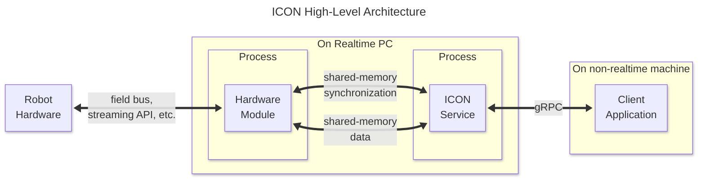
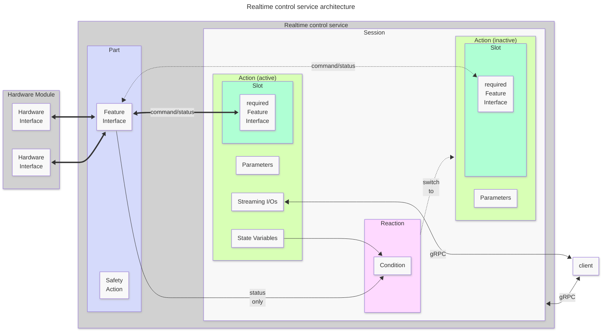
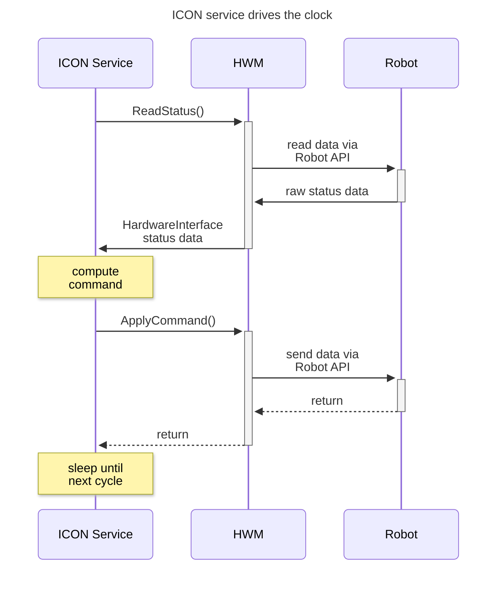
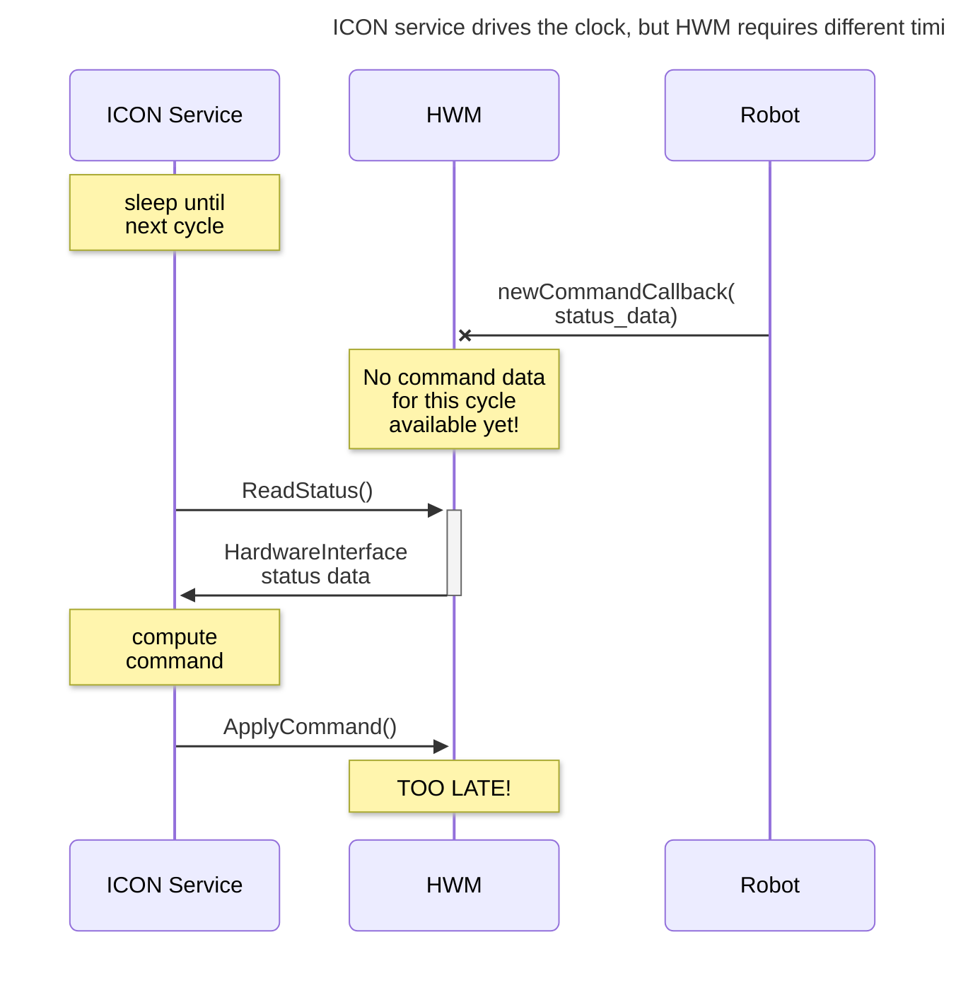
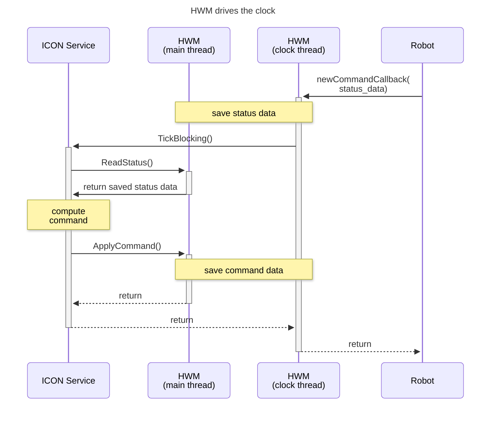

# ICON: The Intrinsic Control Framework

The Intrinsic Core (IC), and Intrinsic platform generally, uses a bespoke
collection of software called ICON to move robots in the physical world. We've
built this software to enable certain capabilities and alleviate certain pain
points in specific use cases of industrial automation.

This, of course, means tradeoffs. In other use cases, ICON may well introduce
*new* pain points when compared to alternatives like
[`ros2_control`](https://control.ros.org/) or [Orocos](https://orocos.org/).

## Overview

Moving a robot with ICON requires three components (four, if you count the robot itself):

* A hardware module (HWM)

  Basically a driver for a specific (type of) robot

* A realtime control service (sometimes called "ICON server")

  Hosts control algorithms ("actions") that users can string together into state
  machines using "reactions".

* A client process that commands the realtime control service via gRPC ("ICON client")

The following diagram shows these three components at a high level:



The diagram shows an important aspect of the system: The ICON service and
hardware module are both hard-realtime processes. They run on the same machine,
but are completely separate processes. This allows the ICON service to report
and recover from faults in the HWM, up to and including a crash of the entire
HWM process.

While this doesn't make a big difference in a single-HWM setup, the ICON service
can also connect to multiple HWMs. In this case, the ability to cleanly stop and
shut down any remaining HWMs means the system comes to a more controlled stop,
as opposed to one faulty HWM taking all the others down with it.

Of course, this diagram is very very simplified. The following sections go into
more detail on the APIs between each of the high-level blocks, and some of their
internals as well.

# Hardware Module <-> Realtime Control Service API

Hardware Modules and the ICON service communicate via a [custom shared-memory
transport](https://github.com/intrinsic-ai/icon-shared-memory) that uses one
well-known Unix domain socket (for instance `/tmp/intrinsic_icon/icon_hwm.sock`)
to share the available interfaces, and anonymous file descriptors for each
interface.

> [!NOTE]
> For ICON, the name of the domain socket is always composed of
> 1. A well-known prefix (`/tmp/intrinsic_icon/`)
> 2. The hardware module name. This is either the asset instance name, or the 
>    [`name`](/intrinsic_apis/intrinsic/icon/hal/proto/hardware_module_config.proto#L38)
>    field of the hardware module's config message (if present).

Each interface has a fixed type and can contain any data, including
[`futex`](https://man7.org/linux/man-pages/man2/futex.2.html)es and
[Flatbuffers](https://flatbuffers.dev/). We use the former to synchronize
control steps and trigger remote function calls, and the latter to transmit
control and sensor data.

ICON adds some additional semantics and features on top of this basic transport:

First, the ICON service can use interfaces with `futex`es to trigger function
calls in a HWM and vice versa. This allows low-overhead lockstep synchronization
between the ICON service and HWMs, as well as asynchronous state changes. As an
example of the latter, a HWM is allowed to take as much time as it needs at
startup to set up its realtime operation.

Next, we call those interfaces that hold Flatbuffers (plus some metadata)
hardware interfaces. Each HWM can expose any number of hardware interfaces, and
tag each one to indicate whether or not it **must** receive new data in every
single control cycle. The ICON service is aware of a finite set of hardware
interface types and knows how to deal with them. You can extend this set, but
only at compile time and not via plugins. The full process to do so is beyond
the scope of this introduction.

> [!NOTE]
> The fact that hardware interfaces are **typed** is important: There's no way
> to accidentally connect, for example, an interface that contains force/torque
> sensor data, to something that expects joint position data.
>
> Similarly for interfaces that require new data every cycle. ICON detects stale
> values at the framework level, rather than forcing each individual consumer to
> do so.

## Realtime Control Service internals: Parts, Sessions, Actions, and Reactions

Moving on to the realtime control service ("ICON service") itself, let's take a
closer look at how it works internally, starting with another diagram:



This diagram shows the part of the system between the gRPC client and the
Hardware Module(s), i.e. the ICON service.

### Actions

As mentioned in the overview, the ICON service hosts control algorithms
(**"actions"**) that users can string together into state machines using
**reactions**. Each action fulfills one clearly defined purpose, like

* "Follow a trajectory"
* "Move to a target in joint space (observing robot limits)"
* "Read and/or write GPIOs"
* "Read streaming position targets from a client, and move a robot to those
  targets using compliant control with a force/torque sensor" (note that the
  action doesn't know or care whether the force/torque sensor is built into the
  robot arm or connected to an external field bus and bolted to the robot)

That last example shows how powerful an action can be.

There are a number of built-in actions, but you can also build your own
using the Intrinsic Core source code.

Actions take parameters at construction time and keep them for their
lifetime. Actions can also receive streaming inputs from, and send streaming
outputs to, the client.

Each action has a **signature** that describes its interfaces (parameter type,
optional and required interfaces, streaming inputs/outputs and state
variables). You can request a list of all available action signatures from the
ICON service using
[`ListActionSignatures()`](/intrinsic_apis/intrinsic/icon/proto/v1/service.proto#L520), or `inctl icon list-actions --address=localhost:17080 --instance_name my_control_service`.

### Parts

Actions **do not** interact directly with hardware interfaces. Instead,
so-called **parts** can transform one or more hardware interfaces into
feature interfaces. The API of a feature interface consists of C++ method
calls, rather than reading and writing Flatbuffers directly.

Semantically, a part represents a piece of equipment that can only be commanded
atomically, like

* a gripper
* a bank of GPIO pins
* a robot arm consisting of six joints
* a force/torque sensor

Clients can claim exclusive command access to a set of parts by opening a
**session**. So it is impossible to have two clients send (potentially conflicting)
commands to the same part.

> [!NOTE]
> There is **no** requirement that a part must only use hardware interfaces from
> a single HWM, or that it must use **all** hardware interfaces from a
> HWM. This means a single HWM can be "split" across multiple parts.
>
> Consider a HWM that exposes all devices on a field bus as hardware
> interfaces. It makes sense to group the interfaces for each device into parts,
> so that users can command the devices independently.
>
> Conversely, a single part can also bundle hardware interfaces from multiple
> HWMs. For example, if a force/torque sensor is bolted to a robot, it might
> make sense to treat the combination of the two as a single part, even if they
> use different HWMs.

Now, back to actions for a bit. All user-controlled actions exist as part of a
session, and can only access the feature interfaces of the parts that that
session owns.

Using feature interfaces to interact with actions allows ICON to enforce things
like joint limits at a framework level, and keep the error messages close to
where the error happens.

Take a limit violation, for example: If an action was allowed to write directly
to the hardware interface's command flatbuffer, then detecting an incorrect
command could take as long as the next control cycle, when the hardware module
reads the faulty command. But with a `FeatureInferface`, ICON can

* detect the faulty command early
* stop the action (and the session that it lives in)
* report a clear error about what went wrong, and where
* hand control of the hardware to a **safety action**

That last point is a bit strange: If an error causes the Session to end, how can
there be another action to switch to? Well, recall:

> All **user-controlled** actions exist as part of a session, [...]

So it stands to reason that the safety action is not user-controlled. That's
exactly right. Each part has a safety action - an action that

* does not require any parameters
* doesn't send/receive any streaming I/Os
* brings the part into a safe state (for a robot, that usually means stopping
  all motion as quickly as the limits allow)

The ICON service's configuration defines a safety action for each Part, and you
can customize the safety action for a given application, if necessary.

### Reactions

Finally, ICON has a cool party trick: It can switch between actions in a single
control cycle, based on sensor data or state variables that actions can
expose. Clients can use a session to set up **reactions**. Each reaction
consists of

* the (ID of the) action it is attached to (the reaction only evaluates its
  conditions when that action is active)
* one or more **conditions** (i.e. `seconds_elapsed > 42.0 || goal_reached ==
  true`)
* a realtime **response** (this can start another action, and optionally stop
  the current one)

Conditions can do simple comparisons (lesser than, greater than, equals) on
**state variables**. You can combine several such comparisons by boolean AND /
OR (aka conjunctions and disjunctions). State variables can come from one of two
sources:

* The action that a reaction is attached to. Each action can expose any number
  of state variables, and updates them as it runs.
* The robot status. The ICON service exposes (some parts of) the robot status as
  state variables.

In addition to the *realtime* response, clients can also set up non-realtime
responses. Each reaction can trigger a callback on the client side, so the
client can react to the event as required.

By mixing realtime and non-realtime responses, clients can build powerful state
machines that can accomplish complex tasks (like rigid insertion) with high
reliability and minimal waiting for the slow non-realtime client side.

## Clock Driving

Normally, the realtime control service (ICON service) keeps a clock and invokes
`ReadStatus()` / `ApplyCommand()` methods on the hardware modules that it
connects to:



But many robot manufacturers provide driver APIs that want to decide *exactly
when* they receive data. For example, the driver might invoke a callback when it
has sensor data and/or needs new command data. If the ICON service were to keep
time in this scenario, a skew between the driver's clock the and ICON service's
clock would eventually cause either a missed update and lead to control
inaccuracies:



To work around this problem, ICON allows one hardware module to become the "clock
driver". This inverts the relation between the ICON service and HWM: Now the HWM
tells the ICON service when to compute the next control step, not the other way
around:



> [!CAUTION]
> A clock-driving HWM **must** have a separate thread to invoke `TickBlocking()`!
>
> Since `TickBlocking()`, well, blocks, using a single thread would cause a
> deadlock.

> [!NOTE]
> There can only be one clock driver per ICON service.

## Operational state

Each hardware module reports a
[`HardwareModuleState`](/intrinsic_control/intrinsic/icon/hal/interfaces/hardware_module_state.fbs). Transitions
between states follow [this state
machine](/intrinsic_control/intrinsic/icon/hal/hardware_module_interface.h#L62).

The ICON service manages the states of all hardware modules, and aggregates
those states into a simpler state model called
[`OperationalState`](/intrinsic_apis/intrinsic/icon/proto/v1/types.proto#L352)
with only three states:

* Disabled
* Enabled
* Faulted

> [!NOTE]
> A hardware module, or the ICON service in general, can enter the faulted state
> at any time, unrelated to user input (for example, due to a hardware problem,
> a power outage, e-stop event, or collision).
>
> If this happens, ICON terminates all sessions with an error message that
> contains as much information as possible about the cause of the fault.

The exact mapping from `HardwareModuleState` to `OperationalState` isn't too
important here. What *is* important is that the ICON service calculates its
`OperationalState` from the `HardwareModuleState` of **all** hardware
modules. That is:

* If **any** hardware module is faulted, the ICON service is faulted.

  The ICON service takes steps to **disable** any hardware modules that are still
  enabled, to stop any motion.
* Otherwise, if **any** hardware module is disabled, then the ICON service is
  disabled.

  The ICON service takes steps to **enable** any hardware modules that are
  disabled, in order to reach the enabled state.
* Finally, if **all** hardware modules are enabled, then the ICON service is
  enabled.

To recover from a fault, you must use the ICON service's `ClearFaults()`
function. Clearing faults puts hardware modules into the disabled state, and
from there the ICON service enables them automatically, as described above.

### Cell control hardware

Sometimes, you may have a hardware module that you **don't** want to tie to the
state of all others. One example is a hardware module that reads and controls
features of your robot cell, like door locks or reset pins.

Losing access to those interfaces when a robot faults because of a collision
would be inconvenient, so the ICON service allows you to divide hardware modules
into "cell control" and "operational" groups:

|                         | Operational HWM | Cell Control HWM |
|-------------------------|-----------------|------------------|
| Operational HWM faults  | Disable         | **Keep Enabled** |
| Cell Control HWM faults | Disable         | Disable          |

## ICON Configuration

To use ICON, you have to provide it with a configuration file. This file
contains an
[`intrinsic_proto.icon.IconMainConfig`](/intrinsic_apis/intrinsic/icon/server/config/icon_main_config.proto#L73)
proto that defines several things:

* Which **hardware modules (HWMs)** ICON connects to
* Which, if any, of the HWMs is the clock driver
* The control frequency of the server (this must match the control frequencies
  of **all** HWMs)
* Which **parts** are available and for each part:
  * its **safety action**
  * which hardware interfaces it uses
  * part-specific configuration

Each ICON service binary contains an [autoconfig gRPC
service](/intrinsic_control/intrinsic/icon/proto/v1/autogenerated_icon_config_service.proto)
that you can use to generate a configuration. In many cases, this is enough to
generate a fully functional configuration:

```bash
# Establish an SSH tunnel to the running realtime control service.
# You can find the resource name by introspecting your cluster, but
# rs-$RESOURCE_NAME-0 is a good first guess.
inctl cluster port-forward \
    --address localhost:17080 \
    --local-port 9091 \
    --remote-port 9091 \
    --resource rs-your-resource-name-0 \
    --namespace app-resources

# Either put the tunnel in the background, or run this in a different terminal
curl localhost:9091/v1/mainConfig:autoGenerate?world_id=world

# Or, if you have jq (https://jqlang.org/) installed and want nice formatting:
curl localhost:9091/v1/mainConfig:autoGenerate?world_id=world | jq
```

(This returns the configuration in JSON format, but the translation to text proto 
is pretty straightforward)

If you do need to manually configure your control service, read on.

### Overall server configuration

Before we get to the interesting parts, some boilerplate. Almost all ICON server
configs share these lines:

```textproto
# This sets up a dependency on another asset instance that provides
# the Intrinsic runtime services. The Intrinsic Core automatically
# finds an asset that fulfills this dependency.
intrinsic_runtime {
  name: "intrinsic_runtime"
}
# Any configuration that contains a HalArmPart (see below)
# needs these. ICON 'services' take some data from the
# Intrinsic runtime environment and expose it to ICON parts
# in a realtime friendly way.
services {
  world_service_from_grpc { world_id: "world" }
  kinematics_from_world_service: true
  assembly_from_world_service: true
}
```

The first and most important "real" configuration value is
`control_frequency_hz`. Set this to match your hardware module(s).

Next, provide the names of all HWMs (i.e. either their instance names, or the 
`name` field of their `HardwareModuleConfig`):

```textproto
hardware_module_names: ["first_hwm", "second_hwm"]
```

You may also see this notation. It's completely equivalent.
```textproto
hardware_module_names: "first_hwm"
hardware_module_names: "second_hwm"
```

Finally, put the name of the clock driver HWM:

```textproto
hardware_module_that_drives_clock: "robot_module"
```

### Part configuration

Each part has a
[`RealtimePartConfig`](/intrinsic_apis/intrinsic/icon/control/parts/proto/v1/realtime_part_config.proto#L31)
that contains a few generic parameters, and an `Any` proto for part-specific
configuration. The generic parameters are fairly straightforward:

* `part_type_name`

  This tells the ICON server which part class to instantiate. Each part
  [registers its name and factory at compile time in a global
  registry](/intrinsic_control/intrinsic/icon/control/parts/hal/force_torque_sensor_part/hal_force_torque_sensor_part_register.cc).
* `safety_action_type_name`

  This defines the safety action for the part. For robots this is pretty much
  always `intrinsic.stop`. For things that don't move, `intrinsic.empty` (a
  no-op) is usually a good choice.
* `hardware_resource_name`

  Many parts need information about the kinematics of a piece of hardware, for
  example to read limit values, or to do forward or inverse kinematics
  calculations. This is the name of an Intrinsic resource that has the relevant
  kinematics model.

> [!TIP]
>
> All part configurations reference one or more hardware
> interfaces. Unfortunately the exact hardware interfaces that a HWM offers are
> not known at build time, because they can depend on configuration. But you can
> use the
> [`hardware_module_introspection`](/intrinsic_control/intrinsic/icon/hal/tools/hardware_module_introspection.cc)
> tool to find the hardware interface names for any *running* HWM.

[This
folder](/intrinsic_apis/intrinsic/icon/control/parts/hal)
contains the configuration protos for all available parts. Here are some
examples for the three most commonly-used ones.

#### [`HalArmPart`](/intrinsic_control/intrinsic/icon/control/parts/hal/arm_part/hal_arm_part.h)

[`intrinsic_proto.icon.HalArmPartConfig`](/intrinsic_apis/intrinsic/icon/control/parts/hal/arm_part/hal_arm_part_config.proto#L16C9-L16C25)

Use this to drive industrial robot arms. In many situations you can omit most of
the members. For instance, this is a pretty average `HalArmPart` configuration:

```textproto
joint_position_command:   { module_name: "my_hwm" interface_name: "joint_position_command" }
joint_position_state:     { module_name: "my_hwm" interface_name: "joint_position_state" }
joint_velocity_state:     { module_name: "my_hwm" interface_name: "joint_velocity_state" }
joint_acceleration_state: { module_name: "my_hwm" interface_name: "joint_acceleration_state" }
payload_command:          { module_name: "my_hwm" interface_name: "payload_command" }
payload_state:            { module_name: "my_hwm" interface_name: "payload_state" }
```

#### [`HalADIOPart`](/intrinsic_control/intrinsic/icon/control/parts/hal/adio_part/hal_adio_part.h)

[`intrinsic_proto.icon.HalArmPartConfig`](/intrinsic_apis/intrinsic/icon/control/parts/hal/adio_part/hal_adio_part_config.proto#L16)

This part handles **A**nalog and **D**igital **IO** pins. For example:


```textproto
digital_outputs: { interface: { module_name: "my_hwm" interface_name: "digital_output_command" } export_name: "valve_control_outputs" }
digital_inputs: { interface: { module_name: "my_hwm" interface_name: "digital_input_status" } export_name: "gripper_input_bock" }
```

Note the `export_name` field. Sometimes HWMs have hardware interfaces with
unwieldy names for input and output blocks, and you want to expose them to
actions under a more meaningful name.


#### [`HalForceTorqueSensorPart`](/intrinsic_control/intrinsic/icon/control/parts/hal/force_torque_sensor_part/hal_force_torque_sensor_part.h)

[`intrinsic_proto.icon.HalForceTorqueSensorPartConfig`](/intrinsic_apis/intrinsic/icon/control/parts/hal/force_torque_sensor_part/hal_force_torque_sensor_part_config.proto#L11)

This part has a few more configuration options, because it not only transmits
force/torqe sensor readings from a hardware interface to an action, but can
additionally do things like estimating the post-sensor dynamic load.

```textproto
force_torque_state:  {
  module_name:  "ft_module"
  interface_name:  "force_torque_status"
}
force_torque_command:  {
  module_name:  "ft_module"
  interface_name:  "force_torque_command"
}
world_robot_collection_name:  "robot"
joint_position_state:  {
  module_name:  "robot_module"
  interface_name:  "joint_position_state"
}
joint_velocity_state:  {
  module_name:  "robot_module"
  interface_name:  "joint_velocity_state"
}
target_link_name:  "wrist_3_link"
ft_sensor_link_name:  "MyForceTorqueSensor"
ft_t_cog:  0
ft_t_cog:  0
ft_t_cog:  0
force_control_settings:  {
  excessive_force_threshold:  50
  excessive_torque_threshold:  50
  virtual_translational_inertia:  7
  virtual_rotational_inertia:  7
  sensed_wrench_deadband:  {
    x:  0.5
    y:  0.5
    z:  0.5
    rx:  0.05
    ry:  0.05
    rz:  0.05
  }
}
```

### Complete example config

Below is a configuration for a real-world FANUC robot with an external
force/torque sensor, as well as a cell control HWM:

```textproto
# proto-file: google/protobuf/any.proto
# proto-message: google.protobuf.Any

# This ICON configuration defines a setup for a Fanuc robot with a force-torque sensor.
# It includes the following parts: an "arm" (HalArmPart), an "ft_sensor" (HalForceTorqueSensorPart),
# general "adio" (HalADIOPart), and "cell_control_io" (HalADIOPart).
# The configuration utilizes two EtherCAT hardware modules: "ft_sensor" for interfacing with a
# force-torque sensor and "ek1100_el1008_el2008" for cell control digital I/O, in addition to the
# main "robot" hardware module.
[type.googleapis.com/intrinsic_proto.icon.IconMainConfig] {
  intrinsic_runtime {
    name: "intrinsic_runtime"
  }
  control_frequency_hz: 250
  hardware_module_read_write_timeout_seconds: 10
  services {
    world_service_from_grpc { world_id: "world" }
    kinematics_from_world_service: true
    assembly_from_world_service: true
  }

  realtime_control_config {
    parts_by_name {
      key: "arm"
      value: {
        part_type_name: "HalArmPart"
        safety_action_type_name: "intrinsic.stop"
        hardware_resource_name: "robot"
        config: {
          [type.googleapis.com/intrinsic_proto.icon.HalArmPartConfig] {
            kinematics_model_name: "arm"
            joint_position_command: { module_name: "robot" interface_name: "joint_position_command" }
            joint_commanded_position: { module_name: "robot" interface_name: "joint_commanded_position" }
            joint_position_state: { module_name: "robot" interface_name: "joint_position_state" }
            joint_system_limits: { module_name: "robot" interface_name: "joint_system_limits" }
            payload_command: { module_name: "robot" interface_name: "payload_command" }
            payload_state: { module_name: "robot" interface_name: "payload_state" }
            calculate_velocity_state_from_position: true
          }
        }
      }

    }
    parts_by_name {
      key: "ft_sensor"
      value: {
        part_type_name: "HalForceTorqueSensorPart"
        safety_action_type_name: "intrinsic.empty"
        config: {
          [type.googleapis.com/intrinsic_proto.icon.HalForceTorqueSensorPartConfig] {
            force_torque_state: { module_name: "ft_sensor" interface_name: "force_torque_status" }
            force_torque_command: { module_name: "ft_sensor" interface_name: "force_torque_command" }
            joint_position_state: { module_name: "robot" interface_name: "joint_position_state" }
            joint_velocity_state: { module_name: "robot" interface_name: "joint_velocity_state" }
            world_robot_collection_name: "robot"
            estimate_post_sensor_dynamic_load: false
            target_link_name: "tool0"
            ft_sensor_link_name: "AtiForceTorqueSensor"
            support_mass: 0.1
            ft_t_cog: 0.0
            ft_t_cog: 0.0
            ft_t_cog: 0.0
            linear_joint_acceleration_filter_config {
              joint_position_process_noise: 0.001
              joint_velocity_process_noise: 0.001
              joint_acceleration_process_noise: 0.5
              joint_jerk_process_noise: 1250.0
              joint_position_measurement_noise: 1.0E-4
              joint_velocity_measurement_noise: 0.001
              dare_settings {
                max_iterations: 3000
              }
            }
            force_control_settings: {
              excessive_force_threshold: 60.0
              excessive_torque_threshold: 10.0
              virtual_translational_inertia: 5.0
              virtual_rotational_inertia: 5.0
              sensed_wrench_deadband: { x: 0.2 y: 0.2 z: 0.5 rx: 0.05 ry: 0.05 rz: 0.05 }
            }
          }
        }
      }
    }
    parts_by_name: {
      key: "adio"
      value: {
        part_type_name: "HalADIOPart"
        safety_action_type_name: "intrinsic.empty"
        config: {
          [type.googleapis.com/intrinsic_proto.icon.HalADIOPartConfig] {
            digital_inputs: [
              { interface: { module_name: "robot" interface_name: "input" } }
            ]
            digital_outputs: [
              { interface: { module_name: "robot" interface_name: "output" } }
            ]
          }
        }
      }
    }
    parts_by_name: {
      key: "cell_control_io"
      value: {
        part_type_name: "HalADIOPart"
        safety_action_type_name: "intrinsic.empty"
        config: {
          [type.googleapis.com/intrinsic_proto.icon.HalADIOPartConfig] {
            digital_inputs: [
              { interface: { module_name: "ek1100_el1008_el2008" interface_name: "channel_1_inputs" } },
              { interface: { module_name: "ek1100_el1008_el2008" interface_name: "channel_2_inputs" } },
              { interface: { module_name: "ek1100_el1008_el2008" interface_name: "channel_3_inputs" } },
              { interface: { module_name: "ek1100_el1008_el2008" interface_name: "channel_4_inputs" } },
              { interface: { module_name: "ek1100_el1008_el2008" interface_name: "channel_5_inputs" } },
              { interface: { module_name: "ek1100_el1008_el2008" interface_name: "channel_6_inputs" } },
              { interface: { module_name: "ek1100_el1008_el2008" interface_name: "channel_7_inputs" } },
              { interface: { module_name: "ek1100_el1008_el2008" interface_name: "channel_8_inputs" } }
            ]
            digital_outputs: [
              { interface: { module_name: "ek1100_el1008_el2008" interface_name: "channel_1_outputs" } },
              { interface: { module_name: "ek1100_el1008_el2008" interface_name: "channel_2_outputs" } },
              { interface: { module_name: "ek1100_el1008_el2008" interface_name: "channel_3_outputs" } },
              { interface: { module_name: "ek1100_el1008_el2008" interface_name: "channel_4_outputs" } },
              { interface: { module_name: "ek1100_el1008_el2008" interface_name: "channel_5_outputs" } },
              { interface: { module_name: "ek1100_el1008_el2008" interface_name: "channel_6_outputs" } },
              { interface: { module_name: "ek1100_el1008_el2008" interface_name: "channel_7_outputs" } },
              { interface: { module_name: "ek1100_el1008_el2008" interface_name: "channel_8_outputs" } }
            ]
          }
        }
      }
    }
  }
  hardware_module_names: "robot"
  hardware_module_names: "ft_sensor"
  hardware_module_names: "ek1100_el1008_el2008"
  hardware_module_that_drives_clock: "robot"
  hard_deadline: true
  hardware_config {
    key: "ek1100_el1008_el2008"
    value: { cell_control_hardware: {} }
  }
}
```
